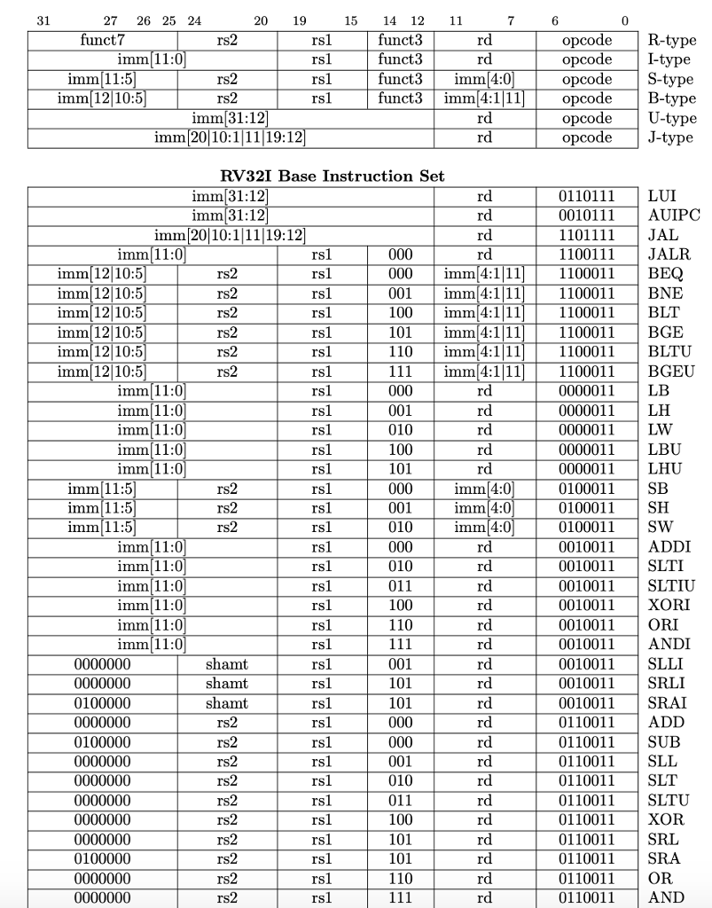
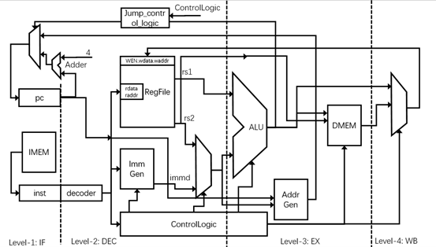

# 操作说明

## 环境搭建

### 阅读器

本文件为Markdown格式，可以直接使用任意text编辑器打开。Markdown格式可使用如[Typora](https://typora.io/)预览编辑（该网址目前是否可以访问？）；在Linux上还可以试试使用ReText。

比如在Ubuntu系统中可使用下列命令安装retext：
####
```bash
sudo apt install retext
```

### 安装Linux系统

建议使用Ubuntu系统。双系统、虚拟机（vmware，hyper-v）、wsl都可以，安装流程请自行搜索。

### 安装依赖项

#### Java的安装

```bash
# Ubuntu一般自带了JDK, 查看Java版本
java -version
```

#### 版本管理工具git，verilog编译器和波形查看工具

```bash
# 安装git
sudo apt install git
# 查看版本
git version
# 安装verilog编译器和波形查看工具
sudo apt install verilator gtkwave
# 查看版本
verilator -version
gtkwave -V
```

#### 安装Scala

Chisel基于Scala构建，需要先安装Scala。

首先在[Scala官网](https://www.scala-lang.org/download/all.html)，选择某一版本release对应的网页。对于2.13及以下版本，可选择适用于Mac OS X, Unix, Cygwin的tgz文件（例如scala-2.13.6.tgz），解压得到scala-2.13.6目录（版本号可能不同）；对于3.0以上版本，需要访问github下载对应的tar.gz文件解压。

```bash
# 手动安装scala到系统目录
sudo cp -r scala-2.13.6 /opt/scala
# 设置相关环境变量，使用你喜欢的编辑器（例如vim）打开个人配置文件
vim ~/.bashrc # 如果是Mac用户，可能需要打开~/.zshrc文件
# 加入以下两行
export SCALA_HOME=/opt/scala #这两行应该加到文件里
export PATH=$SCALA_HOME/bin:$PATH
# 使设置生效
source ~/.bashrc
```

#### 安装sbt
sbt全称为simple build tool，是Scala事实上的标准构建工具，采用以Scala语言本身编写的配置文件实现管理。

其主要特性：

- 原生支持编译Scala代码和与诸多Scala测试框架进行交互；
- 使用Scala编写的DSL（领域特定语言如Chisel）构建描述；
- 使用Ivy作为库管理工具；
- 持续编译、测试和部署；
- 整合scala解释器快速迭代和调试；
- 支持Java与Scala混合的项目。

安装可参考[sbt官网说明](https://www.scala-sbt.org/1.x/docs/zh-cn/Installing-sbt-on-Linux.html)。

```bash
# 安装完以后查看sbt版本
sbt sbtVersion
# sbt构建时间很长，可以自行更换为国内镜像源（例如华为云），请自行搜索。
```

### 拷贝源代码及搭建Chisel环境

```bash
# 在任意目录下新建workspace子目录，例如~/rv_core，并且到该目录中执行，
mkdir -p ~/rv_core/workspace
cd ~/rv_core/workspace
# 将代码目录中的chisel-project和inputs两目录复制到上一步新建的workspace目录中
cp -r <path-to-code>/workspace/chisel-project . (源代码本身和内存数据文本、build规则等，后续会生成其它派生文件）
cp -r <path-to-code>/workspace/inputs . (inputs中仅含.s源文件）
# 然后我们安装新版本的firrtl和chisel
# 安装firrtl， 就在选定目录（如~/rv_core）下执行下列命令（其中compile需要较长时间， 可观察提示）
git clone https://github.com/freechipsproject/firrtl.git && cd firrtl #本句成功会自动进入下一层目录
sbt compile
sbt test # test 可能有fail，可以忽略
sbt assembly
sbt publishLocal
cd .. #回到原目录层次
# 安装chisel3， 就在选定目录（如~/rv_core）下执行下列命令（其中compile需要较长时间， 可观察提示）
git clone https://github.com/freechipsproject/chisel3.git && cd chisel3 #本句成功会自动进入下一层目录
sbt compile
sbt test # test 可能fail，可以忽略
sbt publishLocal
cd .. #回到原目录层次
# 检查是否安装成功
ls ~/.ivy2/local/edu.berkeley.cs/
# 应该能看到 chisel3_2.13  firrtl_2.12 这两个目录（版本号可能不一样）
```

## Chisel使用

chisel-project目录下的src目录用于存放工程的源代码。src目录下又有main和test两个目录，其中main用于存放Chisel的设计，test用于存放对应的测试办法和测试电路。

* gcd计算电路代码位于`workspace/chisel-project/src/main/scala/gcd`下
* gcd测试代码位于`workspace/chisel-project/src/test/scala/gcd`下
* RISC-V处理器代码位于`workspace/chisel-project/src/main/scala/processor`下
* 处理器测试代码位于`workspace/chisel-project/src/test/scala/processor`下

教师提供的文件包中有以上代码源文件(在`workspace/chisel-project`这一层目录中4个设置文件和src下面的源代码是必须的)，在使用Chisel前应该已拷贝到位。

**如果没有特殊说明，以下命令都应该在`workspace/chisel-project`目录下运行。**

### 环境初始化Setup
在`workspace/chisel-project`下运行命令：

```bash
source setup.sh
echo $CHISEL_PROJ	#查看设置好的环境变量
```
此脚本会设置`$CHISEL_PROJ`到`workspace/chisel-project`目录(缺省工作目录)，并增加一个alias *`“cdt=cd $CHISEL_PROJ”`* 以方便随时返回。

### 用GCD(最大公约数)计算电路进行初步实验
gcd电路模块的Chisel代码在`$CHISEL_PROJ/src/main/scala/gcd`下，其定义了一个GCD类。测试代码在`$CHISEL_PROJ/src/test/scala/gcd`下，可以阅读GCDMain类和GCDTester类的注释找到所有可用的测试命令。测试中使用的ScalaTest是基于Scala的开发中最常见的测试工具，其用法可参考[ScalaTest网站](https://www.scalatest.org/)。

执行以下命令，
```bash
sbt "testOnly gcd.GCDTester -- -z Basic"
```
本命令执行了GCDTester类中一个名称包含"Basic"字串的测试。阅读执行结果中`[info]`起头的信息，看本次Baisc Test是否成功。

再次执行以下命令，
```bash
sbt "test:runMain gcd.GCDMain --generate-vcd-output on"
```
本命令的作用是将一个GCD类的实例和GCDUnitTester类的实例通过iotesters.Driver连接在一起实现自动测试，并保存测试的波形文件。命令执行结束后，在`$CHISEL_PROJ/test_run_dir`目录下最新一次生成的子目录中可看到GCD.fir和GCD.vcd等结果文件。

使用`"gtkwave -f"`打开GCD.vcd文件，可以从信号波形看到，电路模块不断被输入两个正整数，在循环计算后会得到一个最大公约数输出。

在上面命令的结果中有FIRRTL格式的电路，如果还想得到gcd电路模块对应的Verilog文件作比较，可以试试用verilator做后端仿真。
执行以下命令，
```bash
sbt "test:runMain gcd.GCDMain --backend-name verilator"
```
本命令执行结束后，在`$CHISEL_PROJ/test_run_dir`目录下最新一次生成的子目录中可看到GCD.v等较多中间文件和结果文件。


### RISC-V Processor初步实验

#### 生成Verilog代码
执行以下命令，
```bash
sbt "test:runMain processor.genProcessor --target-dir generated/processor"
```
本命令执行结束后，在`$CHISEL_PROJ/generated/processor`目录下可得到processor.fir和processor.v文件。

#### 准备汇编程序和机器码
可以通过编写汇编程序来验证处理器实例。现有的汇编程序测试文件均存于`workspace/inputs`目录中(实验前拷贝妥)，部分程序对应的二进制机器码在`$CHISEL_PROJ/src/test`下(实验前拷贝妥)。二进制机器码在测试时会被存放到指令内存(I-memory或IMEM)中。

修改`$CHISEL_PROJ/src/test/scala/processor/test.scala`代码，将`val pattern = ""`的字符串值更改为待测试的文件名，后缀应保持为`.pat`。例如，默认该文件中的pattern为`gcd.pat`，该文件在`$CHISEL_PROJ/src/test`目录下，格式是16进制文本。`$CHISEL_PROJ/src/test`下的其它`.pat`文件也可以用于指令测试等。

如果需要运行新的汇编程序，应生成对应该汇编程序的机器码文件，指定后缀为`.pat`并复制至`$CHISEL_PROJ/src/test`目录下。机器码的格式按16进制文本书写，目前均可按不加0x前缀（可根据运行通过的样例适当编辑）。

#### 数据内存中的初始数据内容
文件`$CHISEL_PROJ/src/test/data_init.pat`是处理器所访问数据内存(D-memory或DMEM)的初始数据内容，共32行。运行汇编程序时可能需要初始的内存值，初步实验时可以采用原有文件中的数值(实验前拷贝妥)。

如果需要修改初始内存数据，则可打开`$CHISEL_PROJ/src/test/data_init.pat`文件，文件中每一行对应相应地址的数据内存内容，可以更改某些地址上的数据。

比如要进行随机数据冒泡排序实例测试，需要事先提供8个数用于排序（存放在初始内存数据的尾部），则可以在`$CHISEL_PROJ`目录下执行，
```bash
python3 create_randnum.py
```
即可更改data_init.pat文件，在数据内存DMEM中存放一批随机数值。

#### 运行processor测试用例
在`$CHISEL_PROJ`目录下运行测试并生成波形文件，
```bash
sbt "test:runMain processor.genTestProcessor --target-dir generated/Processortest --backend-name verilator"
```

本命令在`$CHISEL_PROJ/generated/Processortest`目录下得到仿真结果目录（应该是最新生成的那个），在该目录中存在testTopModule.vcd文件，即为仿真波形文件。可以使用gtkwave查看文件：
```bash
cd generated/Processortest/processor.genTestProcessor*
gtkwave -f ./testTopModule.vcd
cdt # 返回缺省工作目录
```
上面命令中的`*`代表可能的一串唯一数字，应由用户查看最新生成的目录名称后，明确填写该名字。每次运行上述测试步骤时，均可能生成一个新的目录，如果不知道最新的是哪个，可以执行`”ls -drtl generated/Processortest/*“`把目录按照修改时间顺序查看，但还需注意名字是否为processor.genTestProcessor开头。

在`$CHISEL_PROJ/src/test/scala/processor/test.scala`中可以找到可用的4种测试命令。

在`$CHISEL_PROJ/src/test/scala/processor/component.scala`中可以看到testTopModule由一个processor和两块32 words的存储器(IMEM和DMEM)连接构成。

系统开始测试运行时处理器指令pc值为0，当其超过128时测试停止(根据testTopModule.io.ins信号判断)。testTopModule.io.ins就是processor实例的io.ins_pc信号，在研究.vcd波形时，如根据该信号对照指令内存的对应指令（即processor实例中的io.instruction），可以看到指令程序的运行过程。

以测试运行`gcd.pat`（对应汇编程序gcd.s）为例，汇编程序的最后结果和执行返回值分别放在寄存器x8和x9中，则可以观察testTopModule.io.regFile[8/9]的值。

#### 随机汇编程序测试
在`$CHISEL_PROJ`目录下运行测试，
```bash
sbt "test:runMain processor.genRandomTestProcessor --target-dir generated/Processortest --is-verbose"
```
在终端窗口查看软件运算结果和仿真结果的对比结果输出。

在`$CHISEL_PROJ/src/test/assembly/`目录(事先建立好该目录)下会看到本次生成的随机测试汇编程序和相应的机器码文件，RandomProgram.s和RandomProgram.txt。

本次生成的随机测试程序的机器码在测试开始时已填入指令内存(IMEM)中。

## Processor指令、结构简介

### 指令支持

该微核采用RISC-V架构，支持运行RV32I（RISC-V基本32位整数指令集）中的部分指令。

| 指令格式                 |实现情况|       描述                           |
| ----------------------- |:----:|--------------------------------------|
| **R-type**        | | funct7+rs2+rs1+funct3+rd+opcode                 |
| add   rd, rs1, rs2      | √    | Addition                             |
| sub   rd, rs1, rs2      | √    | Substraction                         |
| sll   rd, rs1, rs2      |      | Logical Left Shift                   |
| slt   rd, rs1, rs2      | √    | Set Less Than                        |
| sltu  rd, rs1, rs2      |      | Set Less Than Unsigned               |
| xor   rd, rs1, rs2      | √    | XOR operation                        |
| srl   rd, rs1, rs2      |      | Logical Right Shift                  |
| sra   rd, rs1, rs2      |      | Arithmetic Right Shift               |
| or    rd, rs1, rs2      | √    | OR operation                         |
| and   rd, rs1, rs2      | √    | AND operation                        |
|                         |      |                                      |
| **I-type**        | | imm[11:0]+rs1+funct3+rd+opcode                  |
| lb   rd, offset(rs1)    |      | Load Byte                            |
| lh   rd, offset(rs1)    |      | Load Half Word                       |
| lw   rd, offset(rs1)    | √    | Load Word                            |
| lbu   rd, offset(rs1)   |      | Load Byte Unsigned                   |
| lhu   rd, offset(rs1)   |      | Load Half Word Unsigned              |
| addi   rd, rs1, imm     | √    | Add Immediate                        |
| slti   rd, rs1, imm     | √    | Set Less Than Immediate              |
| sltiu   rd, rs1, imm    |      | Set Less Than Immediate Unsigned     |
| xori   rd, rs1, imm     | √    | XOR Immediate                        |
| ori   rd, rs1, imm      | √    | OR  Immediate                        |
| andi   rd, rs1, imm     | √    | AND Immediate                        |
| slli   rd, rs1, imm     |      | Logical Left Shift Immediate         |
| srli   rd, rs1, imm     |      | Logical Right Shift Immediate        |
| srai   rd, rs1, imm     |      | Arithmetic Right Shift Immediate     |
| jalr   rd, offset(rs2)  | √    | Jump And Link Register               |
|                         |      |                                      |
| **S-type**        | | imm[11:5]+rs2+rs1+funct3+imm[4:0]+opcode        |
| sb   rs2, offset(rs1)   |      | Store Byte                           |
| sh   rs2, offset(rs1)   |      | Store Half Word                      |
| sw   rs2, offset(rs1)   | √    | Store Word                           |
|                         |      |                                      |
| **B-type**        | | imm[11:5]+rs2+rs1+funct3+imm[4"1]imm[11]+opcode |
| beq   rs1, rs2, offset  | √    | Branch Equality                      |
| bne   rs1, rs2, offset  | √    | Branch Not Equal                     |
| blt   rs1, rs2, offset  | √    | Branch Less Than                     |
| bge   rs1, rs2, offset  | √    | Branch Greater Than                  |
| bltu   rs1, rs2, offset |      | Branch Less Than Unsigned            |
| bgeu   rs1, rs2, offset |      | Branch Greater Than Unsigned         |
|                         |      |                                      |
| **U-type**        | | imm[31:12]+rd+opcode                            |
| lui   rd, imm           |      | Load Upper Immediate                 |
| auipc   rd, imm         |      | Add Upper Immediate with PC          |
|                         |      |                                      |
| **J-type**        | | imm[20]imm[10:1]imm[11]imm[19:12]+rd+opcode     |
| jal   rd, offset        |      | Jump And Link


####RV32I基本指令的的bit构成 详见下图：




### 处理器架构

微核为单核32位的RISC-V微处理器示范微核，采用Chisel语言编写。

微核采取流水线结构，四级流水线分别为：

1. 取指令级 (IF)

2. 指令解码级 (DEC)

3. 指令执行级 (EX)

4. 写回级 (WB)

微核的大致结构如下图：



微核具备数据冒险(data hazard)和控制冒险(control hazard)的解决策略，且分开设立指令存储器与数据存储器，避免不同指令同时访问存储器空间造成的结构冒险(structural hazard)现象。

在`$CHISEL_PROJ/src/main/scala/processor.scala`中描述了上述四级流水线模块，以及4个模块相互连接构成的processor整体。可以阅读Chisel代码后，标出结构图中的主要信号线名称，从而予以理解。

代码阅读的主要难点也在于流水线中出现冒险的控制逻辑；需要在本帮助文件以外寻找更多的参考材料理解，或和教师、同学等一起探讨研究（有关流水线结构设计的网上参考资料较多）。

### 项目的目录和文件结构

```bash
├─readme.md # 本帮助文件
├─CoreArch.png # 处理器结构图片
└─RV32I-instr.png # 处理器指令位图片
└─workspace
  ├─chisel-project
  │ ├── build.sbt # sbt项目配置文件
  │ ├── create_randnum.py # bubblesort生成随机数用
  │ ├── scalastyle-config.xml
  │ ├── scalastyle-test-config.xml
  │ ├── setup.sh # 环境设置用
  │ ├── src
  │ │   ├── main
  │ │   │   └── scala
  │ │   │       ├── gcd	# gcd硬件电路Chisel代码
  │ │   │       │   └── GCD.scala
  │ │   │       └── processor # 微核Chisel代码
  │ │   │           ├── ALU1b.scala
  │ │   │           ├── ALU32b.scala
  │ │   │           └── processor.scala
  │ │   └── test # 存放测试输入（如对应汇编程序的机器指令）
  │ │       ├── add.pat # 对应同名汇编程序
  │ │       ├── adven.pat # 对应同名汇编程序
  │ │       ├── bbsort_bug.pat # 对应同名汇编程序
  │ │       ├── data_init.pat # 数据内存初始值
  │ │       ├── gcd.pat # 对应同名汇编程序
  │ │       ├── assembly (需手动建立的目录可存生成汇编程序)
  │ │       └── scala # Scala格式的testbench
  │ │           ├── gcd
  │ │           │   ├── GCDMain.scala
  │ │           │   └── GCDUnitTest.scala
  │ │           └── processor
  │ │               ├── GenProcessor.scala
  │ │               ├── component.scala
  │ │               └── test.scala
  │ └target, test_run_dir, generated, project # 生成的目录
  └─inputs # 微核测试的汇编程序
    ├── adven.s # 冒险验证用
    ├── adven_con.s # 冒险验证用
    ├── bbsort_bug.s # 冒泡排序但有bug
    ├── gcd.s # 求最大公约数
    └── single_insts # 用于测试微核单条指令的汇编程序
        ├── add.s
        └── ...
```

### 测试实验安排

测试实验一般以处理器执行不同的汇编程序进行。

* 首先可对各种单一指令分别进行单项功能性测试。具体方法为给所支持的十余种指令分别编写一个包含单句或几句指令的程序，程序只对该种指令的基本功能具备要求。按照验证流程得到波形图，并将波形变化结果与程序理论值比照。

* 其次对冒险情况进行验证，将adven.s与adven_con.s汇编程序按照流程进行验证（测试时选择对应的.pat文件），并与理论推算对比。数据冒险观察存储器/寄存器数据的变化是否按程序顺序其数值是否正确，控制冒险观察流水线清空信号跳变高电平次数是否正确。值得关注信号的名称关键词有Stall, Flush。

* 随后测试冒泡排序汇编程序，可以修改data_init.s中的排序数据（或重新让create_randnum.py随机生成），参照bbsort_bug.s程序观察核内信号波形，观察存储器中存储内容交换的过程及最终排序的结果，发现汇编程序的bug。

* 随机汇编程序验证。运行随机指令生成对应的sbt命令，通过终端窗口验证比对结果。自己如希望编写其它目的的汇编程序，借助RISC-V Online Assembler也可形成对应的二进制文件（或配置使用gcc）；比如修改bbsort_bug.s后可生成新的.pat文件。

* 最后可以再回到GCD功能比对验证。写作新的测试方法分别调用processor电路和gcd电路，将微核验证结果（软件求gcd值）波形图与GCD电路验证结果（硬件求gcd值）进行相互比对，得到验证结果。


GCD硬件模块的测试输入在`chisel-project/src/test/scala/gcd/GCDUnitTest.scala`中36~37行：

```scala
  for(i <- 1 to 40 by 3) {
    for (j <- 1 to 40 by 7) {
      poke(gcd.io.value1, i)
      poke(gcd.io.value2, j)
      ...
```
这里操作数1为1, 4, 7, ..., 操作数2为1, 8, 15, ..., 可以根据需要修改。如能编写RISC-V汇编程序产生操作数，同时输入到GCD硬件模块，即可以实现软硬件结果对比。

